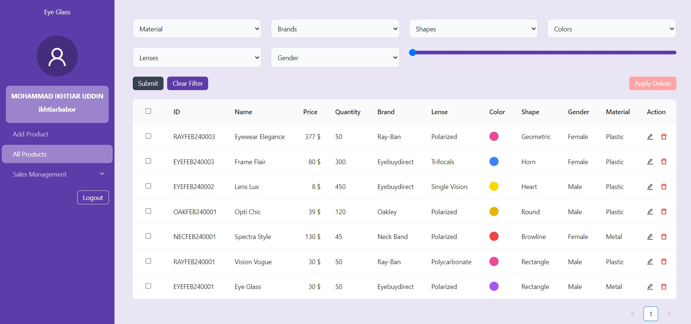
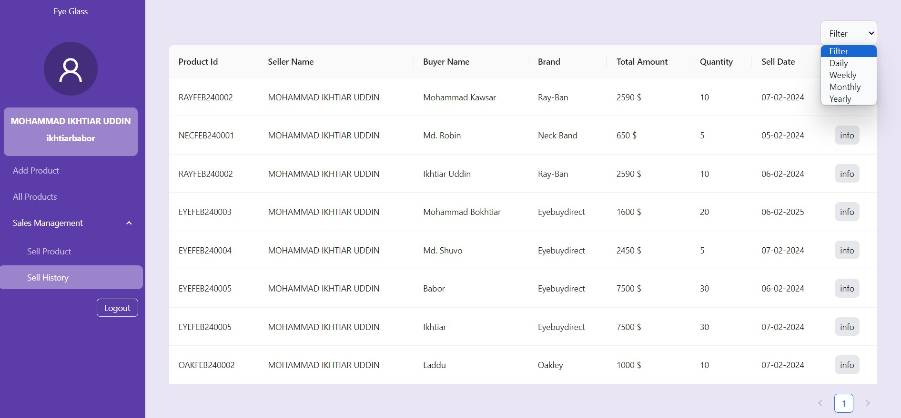
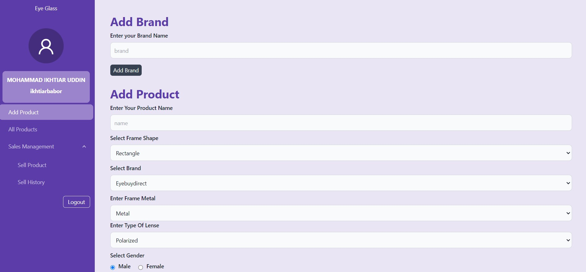
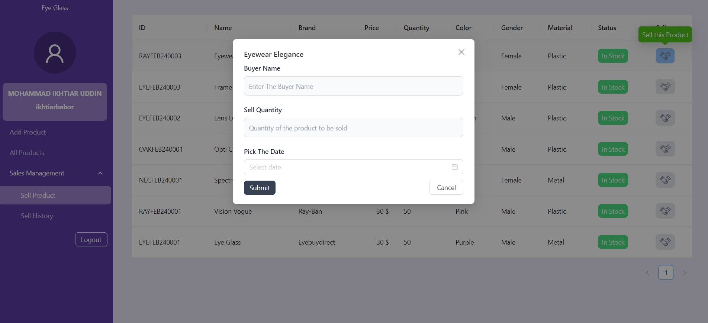

<div align="center">
  
  
  
  
</div>

# Eye Glass Admin Dashboard

Welcome to the Eye Glass Admin Dashboard, a React Vite application for managing your eyewear inventory and sales.

## Features

- **Product Management:**
  - Add new products
  - Add brands
  - View all products
  - Delete multiple products at once

- **Filtering:**
  - Filter products by brand, material, quantity, and price

- **Sales:**
  - Sell products
  - Automatically remove out-of-stock products from the frontend

- **Sales History:**
  - View sales history
  - Filter sales by daily, weekly, and yearly data

- **State Management:**
  - Redux is used for state management

## Usage

To use this project, follow these steps:

1. Clone the project repository:

   ```bash
   git clone <repository_url>

2. Navigate to the project directory:

```bash
cd eye-glass

3. Install all dependencies using Yarn:

```bash
yarn

4. Run the development server:
```bash
yarn dev

This will start the development server, and you can access the Eye Glass Admin Dashboard in your web browser.
